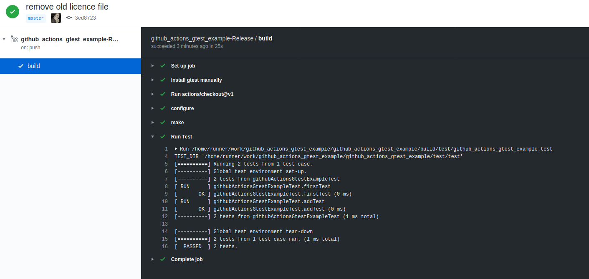
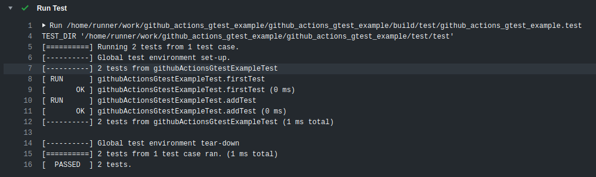
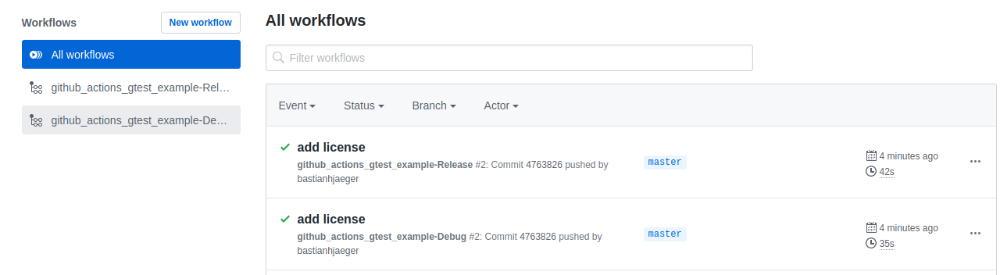

# General


Example on how to integrate gtest test into [github actions](https://github.com/features/actions). 


While there exist other links in the www on how to use it (which did not work for my setup), this repo quickly shows how to add a workflow / action to github that executes your gtest tests and responses with a simple ok / not-ok to highlight on github.

It is plain and simple, but maybe it helps you. 

# Setup Actions

the workflow file you need (e.g. in you repo under `.github/workflows/release.yml`) could look like this

```yaml
name: my-workflow-name

on:
  push:
    branches: [ main ]
  pull_request:
    branches: [ main ]

jobs:
  build:
    runs-on: ubuntu-latest
    steps:
    - name: Install gtest manually
      run: sudo apt-get install libgtest-dev && cd /usr/src/gtest && sudo cmake CMakeLists.txt && sudo make && sudo cp lib/*.a /usr/lib && sudo ln -s /usr/lib/libgtest.a /usr/local/lib/libgtest.a && sudo ln -s /usr/lib/libgtest_main.a /usr/local/lib/libgtest_main.a
    - uses: actions/checkout@v1
    - name: configure
      run: mkdir build && cd build && cmake -DCMAKE_BUILD_TYPE=Release -DCMAKE_CXX_FLAGS="-Werror" ..
    - name: make
      run: cd build && make
    - name: Run Test
      run: /home/runner/work/GTest_Github_Example/GTest_Github_Example/build/test/GTest_Github_Example.test
```

The important part is the *"Install gtest manually"* section. This is the plain and simple way to add it.

# Result

After some time (depending on you project and test complexity) you see the results like this:








# Build local
```bash
git clone https://github.com/prashantpateldixoninfo/GTest_Github_Example.git
cd GTest_Github_Example
mkdir build && cd build
cmake -DCMAKE_BUILD_TYPE=Release ..
make -j8
```
